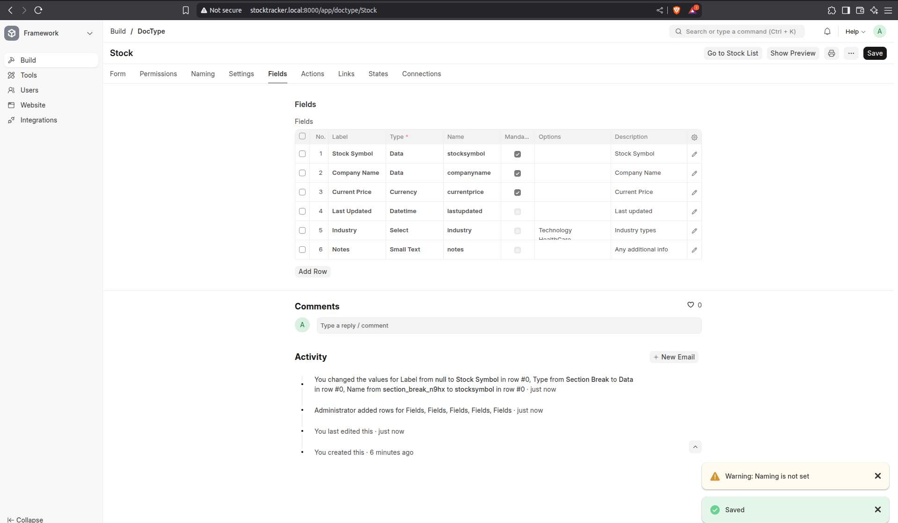
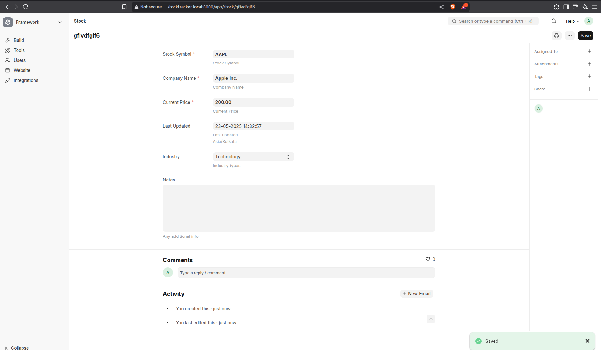
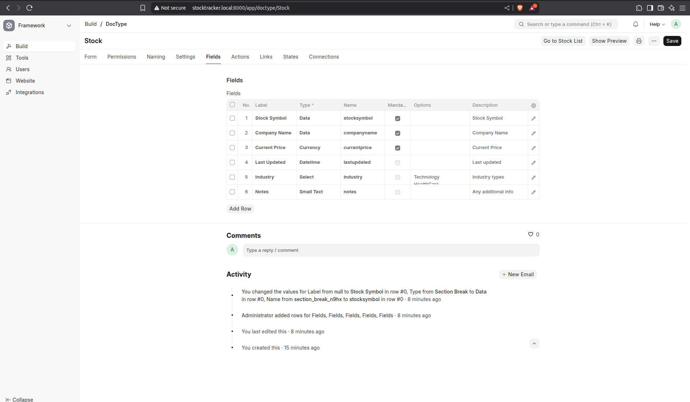
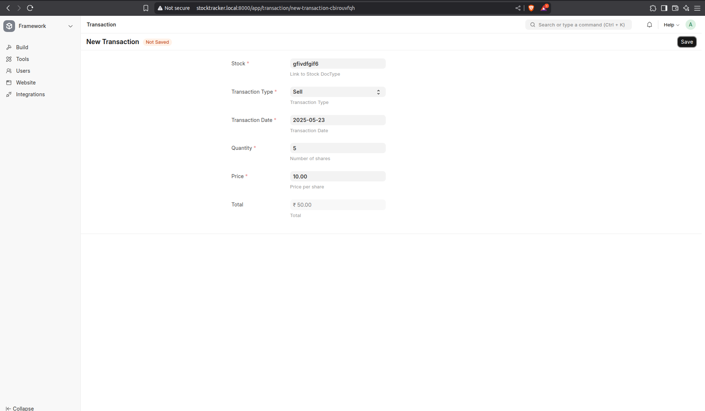
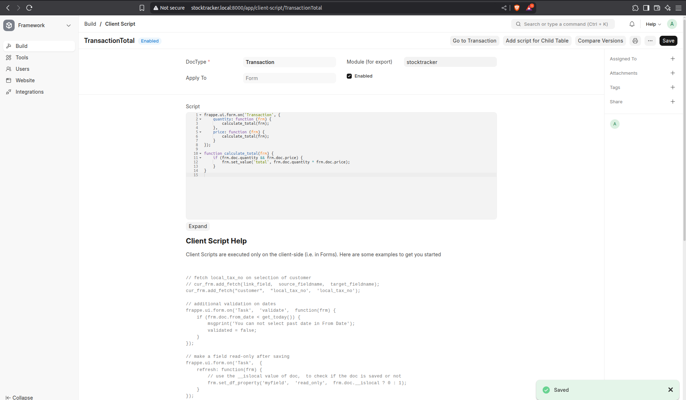
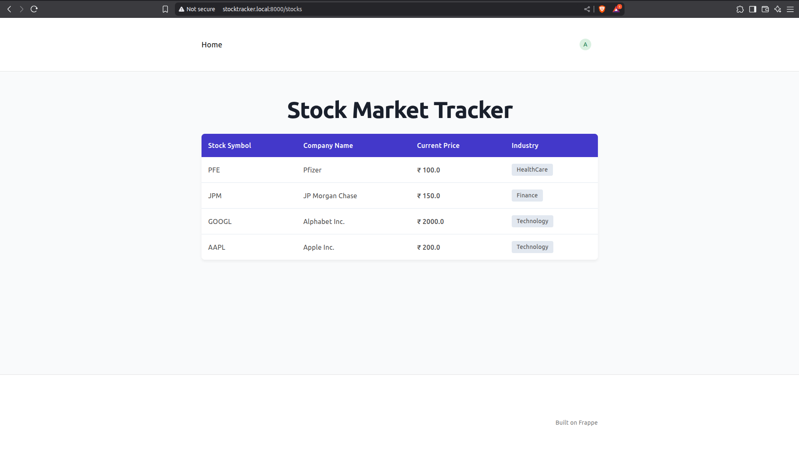
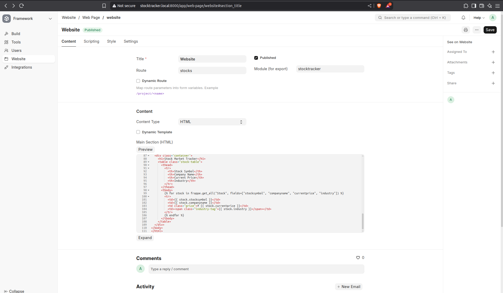

# Frappe - Stock Market Tracker

A Stock Market Tracker Application using the [Frappe framework](https://frappeframework.com/), which performs basic CRUD operations for tracking stocks and transactions

---

## Features
- Track company stocks and their prices
- Record buy/sell transactions
- Auto-update Total and Last-Updated Date fields
- Webpage to view all stocks company-wise

---

## Required DocTypes
### Stock(Master)



### Transactions





---

### Webpage
route: /stocks



---

## Execution Instructions
```bash
bench init <dir-name>
cd <dir-name>

bench new-site stocktracker.local

bench get-app stocktracker https://github.com/kdb04/stockapp.git 

bench --site stocktracker.local install-app stocktracker

bench start
```

## TO-DO
- [x] Bench Setup
- [x] Both DocTypes
- [x] Input Validation
- [x] Website to display stocks
